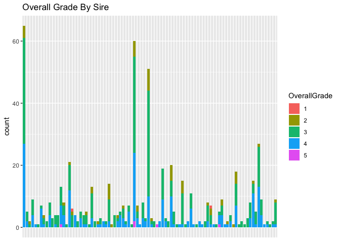
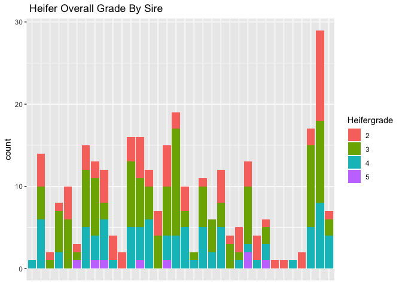
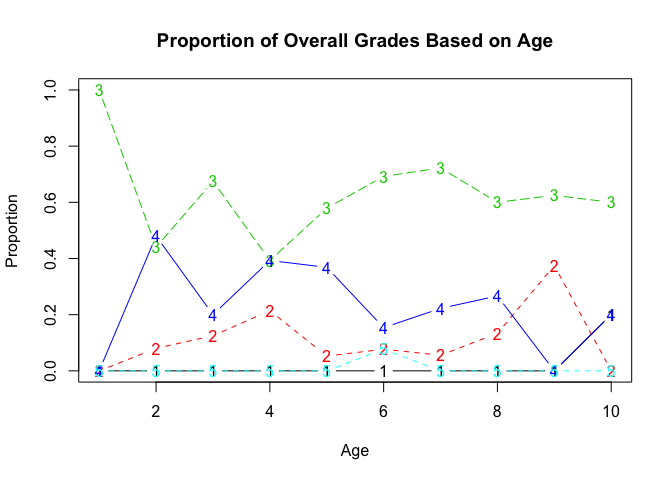
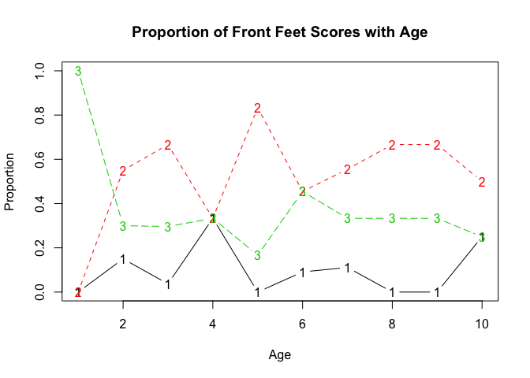

Introduction to the Model
================
Brockton Butcher
1/17/2019

#### Intro

Using statistics to provide evidence of certain phenomena has helped the world reach the level of technology and efficiency we see today. The application to agriculture has created a competitive advantage to the American farmer. One example of this is within cattle breeding, statisticians and geneticists have created a tool known as Expected Progeny Difference (EPD) to help predict the value of future offspring. EPDs are the best and most efficient way to make genetic progress over the course of time. The essential traits in the EPD are derived from: the individuals own performance record, progeny records, records of other relatives within the pedigree, genotyping, and genetic correlations of traits (Select Sires Inc.). Through these methods, terminal traits have imrpoved drastically.

Despite the use of EPDs on the terminal value of future offspring, emphasis on selecting cattle for long lived production has largely been disregarded. Right now, there is one provider of genetic information that estimates production life in beef cattle. This trait, known as stayability, has helped Red Angus and Simmental breeders get an estimate on the production life of their animals. While this estimator has proved useful for these breeds, getting a highly accurate production measure for this EPD early on isn't possible because the performance is measured in production lifetime. This takes a minimum of 6 years to get a truly accurate estimate. This creates a sense of uncertainty in what to expect. The way that most people try to address this issue is by ensuring that the body composition of the animal is sound. The reason for this is that over the course of time ranchers have noticed patterns in visual characteristics that affect the production life cattle. Many of these patterns are obvious, one such trait is the structure of the feet. This trait affects the production life becuase after excessive use they start to deteriorate and they become unable to travel easily and can no longer maintain their required nutrition requirements. After observing this phenomena ranchers began to notice what the make-up of animals that are better suited to resist to these handicaps. Just because an animal expresses this favorable make-up doesn't guarantee a long life, but it gives them a better chance at a longer production life. The goal of this study is to try and create a model much like an EPD that gives the rancher an estimate of the visual composition in the offspring of two animals that have procreated.

##### What my question

The goal of this study is to use visual characteristics gathered from a Bull and a Cow, and create a predictive model that provides a probability for the corresponding distributions of the offspring. Once this initial model is created I would like to also explore the impacts of how the grandparents/lineage of the offspring also effects probability/ strength in priors and if this could be useful in an estimate.

##### Background

#### Data Summary

I collected data on every female animal in production on my ranch, along with yearling females known as heifers. Through this collection I judged each animal on visual measures I thought pertained to the longevity of their production on a scale of 1-5 with 1 being less desirable than 5 and their weight was also measured. There was complete collection of these visual characteristics on 622 cows, and 324 heifers respectively for a total of 946. The first characteristic I measured was frame size, with 1 being smallest and 5 being largest. This can be an idicator of required feed in-take which I believe is related to efficiency and health requirements. Secondly, I judged front feet appearance, which was based on heel angle, the hoof length, size of feet, and cracking of a hoof. This same procdure was done when measuring the hind feet. A score of 1 was considered worst with 5 being a perfect score. Then a judgement of udder quality was measured, this was conducted by characterizing teat size, udder depth, and ligament attachment (levelness of the udder). The final score taken was overall grade, which was a measurement of the overall quality of all characteritics that made them desireable. For the sake of this study, I am wanting to explore the relationship paternal and maternal lineage affect offspring with multinomial data. \#\#\#\#\# the characteristics \#\#\#\#\# the scales \#\#\#\#\# data collection \#\#\#\#\# visualization 

This graph is a good illustration of the variability within each sire group of cows.



This is an illustration of the variability of the overall visual grade for each sire group based on the grades of all heifers.



This graph is an illustration of the overall grades as cows get older, each number corresponds to the characterized grade, with age being the x-axis and the y-axis being the proportion of the age group belonging to the corresponding grade.



This illustration is a little bit more interesting, as time goes on we see that proportionally the amount of 3 grade feet are relatively the same. If this same pattern is expressed through our analysis, we could find that a grade of 3 will be expected throughout the lifetime of an animal. Thus, if we observe a 3 grade at an age of two, proportionally we expect that proportionally the same amount of 3 grades are expected at an age of 10 years. This would significantly improve the knowledge regarding stayability, knowing that there will be significantly less animals taken out of production for being unable to travel.

#### Model

##### assumptions

##### methods

#### Results

##### what we got (model results)

##### how to interpret

##### what inference

#### Conclusion

``` r
d = read.csv('cowswepd')

model = "
model {
for (j in 1:J ) {
y[,j] ~ dmulti(p[,j], n[j])
p[1,j] <-   pnorm(0,       mu[j], 1.0)
p[2,j] <-   pnorm(alpha[1],mu[j], 1.0) - pnorm(0,       mu[j], 1.0)
p[3,j] <-   pnorm(alpha[2],mu[j], 1.0) - pnorm(alpha[1],mu[j], 1.0)
p[4,j] <-   pnorm(alpha[3],mu[j], 1.0) - pnorm(alpha[2],mu[j], 1.0) 
p[5,j] <- 1-pnorm(alpha[3],mu[j], 1.0)
  
  mu[j] ~ dnorm(theta,tau)

                }
for(r in 1:3){
alpha0[r]~dunif(0,10)
}
alpha <- sort(alpha0) #JAGS sort trick

# Hyperparameters for normal means
 theta ~dnorm(0,1e-6)
 tau ~ dgamma(1,1)
}
"

library(rjags)
dat=list(y=t(d[,-1]),n=rowSums(d[,-1]), J=nrow(d))
m=jags.model(textConnection(model),dat, inits=list(mu=rep(1,dat$J), alpha0=1:3))
```

``` r
model {
  for (i in 1:Ntotal) {
    y[i] ~dcat(pr[i,1:nYlevels])
    pr[i,1] <- pnorm(thresh[1], mu[x[i]], 1/sigma[x[i]]^2)
    for (k in 2:(nYlevels-1))n {
      pr[i,k] <- max (0, pnorm(thresh[k], mu[x[i]],1/sigma[x[i]]^2 )
                      -pnorm(thresh[k-1], mu[x[i]],1/sigma[x[i]]^2 ) )
    }
    pr[i,nYlevels] <- 1-pnorm(thresh[nYlevels-1],mu[x[i]],1/sigma[x[i]]^2 ) 
  }
  for (j in 1:2 ) { #2 groups
    mu[j] ~dnorm( (1+nYlevels/2),1/(nYlevels)^2 )
    sigma[j]~dunif(nYlevels/1000, nYlevels*5)
  }
  for ( k in 2:(nYlevels-2) ) {#1 and nYlevels are fixed, not stochastic 
    thresh[k]~dnorm(k+.5, 1/2^2)
  }
}
```

other specification
===================

Jags-Yord-Xnom2grp-MnormalHet.R Jags-Yord-Xnom2grp-MnormalHet-Example.R

``` r
#priors for bulls

#read mother's score
#obtain her records
#records of siblings
#record of sire
#record of sire's offspring
#other scores in lineage

#we want to see if priors are actually a model that can be trusted with resonable confidence based on no progeny for a bull when trying to predict
```

We want to determine the prior for each bull based on his appearance and the information of the mother and the traits that she possesses, along with other performance records within his lineage. If we see that most of the time his mother has offspring with a 4 foot score, and his father has offspring mostly with a 3 footscore we would like to think that on average he would produce mostly 3's and 4's. Then through the course of time we would
