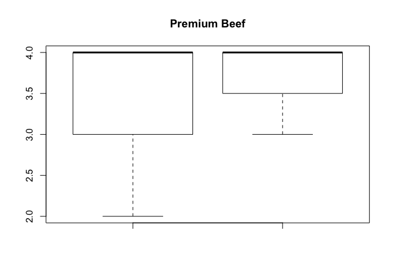

Introduction to the Model
================
Brockton Butcher
1/17/2019

    ## 
    ## Attaching package: 'dplyr'

    ## The following objects are masked from 'package:stats':
    ## 
    ##     filter, lag

    ## The following objects are masked from 'package:base':
    ## 
    ##     intersect, setdiff, setequal, union

    ## [1] "dplyr"

#### Intro

Using statistics to provide evidence of certain phenomena has helped the world reach the level of technology and efficiency we see today. The application to agriculture has created a competitive advantage to the American farmer. One example of this is within cattle breeding, statisticians and geneticists have created a tool known as Expected Progeny Difference (EPD) to help predict the value of future offspring. EPDs are the best and most efficient way to make genetic progress over the course of time. EPDs are derived from: the individuals own performance record, progeny records, records of other relatives within the pedigree, genotyping, and genetic correlations of traits (Select Sires Inc.). Through these methods, terminal traits have imrpoved drastically.

Despite the use of EPDs on the terminal value of future offspring, emphasis on selecting cattle for long lived production has largely been disregarded. Right now, there is one provider of genetic information that estimates production life in beef cattle. This trait, known as stayability, has helped Red Angus and Simmental breeders get an estimate on the production life of their animals. While this estimator has proved useful for these breeds, getting a highly accurate production measure for this EPD early on isn't possible because the performance is measured in production lifetime. This takes a minimum of 6 years to get a truly accurate estimate. This creates a sense of uncertainty in what to expect. The way that most people try to address this issue is by ensuring that the body composition of the animal is adequate. Over the course of time ranchers have noticed patterns in visual characteristics that affect the production life of cattle. Many of these patterns are obvious, one such trait is the structure of the feet. This trait affects the production life becuase after excessive use they start to deteriorate and they become unable to travel easily and can no longer maintain their required nutrition requirements, much like being injured. After observing this phenomena ranchers began to notice what the ideal make-up of animals that are better suited to resist these handicaps. Just because an animal expresses this favorable make-up doesn't guarantee a long life, but it gives them a better chance at a longer production life. \#\#\#\#\# Question We Want To Address The goal of this study is to assess if there is a relationship between the score of a calf's front feet and the mother's front feet. Then to further assess if certain bulls, influence the expression in their offsprong. For the purpose of this study we are wanting to measure if the cows having better feet has a relationship to calves that express a favorable expression. Regarding the bulls, we want to analyze if they influence the expression in their offspring differently when controlling for the cow's front feet.

##### Background

Through the course of my life I have noticed that there are certain Sire groups within the herd that more favorably express traits such as feet and udder quality. This was the reason as to why I wanted to explore this question. In particular, Advantage, is one bull that I suspect shows a negative difference in foot composition when compared to the cows that he is bred to. I have suspected this difference due to the foot composition that he expresses himself. \#\#\#\# Data Summary I collected data on every female animal in production on my ranch, along with yearling females known as heifers. Through this collection I judged each animal on visual measures I thought pertained to the longevity of their production on a scale of 1-5 with 1 being less desirable than 5. There was complete collection of these visual characteristics on 622 cows, and 324 heifers respectively for a total of 946. \#\#\#\#\# the scales We characterized a score of 1 as unacceptable, 2 below average, 3 as average, 4 above average, and 5 as highly desireable. The form of this data is ordinal with each category being having no union with any other level.

##### Data collection

When collecting the data on these animals we judged each animal in a pen one at a time, grading each characteristic we were interested in estimating. The characteristics we are interested in for this study are front feet appearance and rear feet appearance, which was based on heel depth, hoof length, size of feet, and cracking of the a hoof. This took place over the course of a 4 day period.

##### Visualization


This is an illustration of the variability of the Front Feet grade for each Sire group. As we can see there are proportional differences in the different groups.


This is a further illustration of the expression of calf's front feet when categorized by their Sire and mother.



This plot is a good illustration as the score of the Cow's front feet increases the probability of observating a calf's feet grade less than 3 is gets smaller.

    ## Loading required package: carData

    ## lattice theme set by effectsTheme()
    ## See ?effectsTheme for details.


This is an illustration of the linearity of the responses.

#### Model

The first thing we want to address in the model is to see if there is a relationship between the calf's front feet and the mother's front feet. We will perform logistic regression to test this conclusion. We will categrize a success as the front feet expressed in the offspring as being equal to or greater than a score of 3, which is considered a favorable expression. The next thing we are interested in addressing is the impact each bull has on his offspring. Since most of the bulls are selected to have a favorable expression of feet, we cannot measure a success as being better than the bull itself. We are wanting to see if there is a difference in probability of observing more favorable outcomes compared to the mother. For this model we will use logistic regression further, and explore other methods such as a sign binomial test to assess if bulls increase favorable expression. In this case, a success is observing a calf with more favorable expression than the mother expressed.

##### assumptions

The assumptions for Binomial Logistic Regression is that each outcome is binary, there is a linear relationship between the logit of the outcome and each predictor varibles, and there are no influential points or outliers. We see from plot (? mark it) that there does appear to be a linear increase in probability. The assumptions for ordinal logistic regression are there can only be one dependent variable. There is one regression equation for each category except the last category. The last category probability can be predicted as 1-second last category probability. Eighty percent of cells must have more than 5 counts and the proportional odds assumption.

##### methods

*F**a**v**o**r**a**b**l**e* ∼ *b**i**n**o**m**i**a**l*(*m* = 1, *π*) *l**o**g**i**t*(*π*{*C**a**l**f**D**i**f**f**e**r**n**c**e*|*C**o**w**S**c**o**r**e*}) = *β*<sub>0</sub> + *β*<sub>1</sub>*C**o**w**F**r**o**n**t*

*P*(*Y*<sub>*i*</sub> ≤ *j*)=*P*(*Z*<sub>*i*</sub> ≤ *θ*<sub>*j*</sub>)=*P*(*Z*<sub>*i*</sub> − *β*<sup>*T*</sup>*x*<sub>*i*</sub> ≤ *θ*<sub>*j*</sub> − *β*<sup>*T*</sup>*x*<sub>*i*</sub>)=*F*(*θ*<sub>*j*</sub> − *β**x*<sub>*i*</sub>) and *F* follows the logistic distribution, where *F*(*x*)=*e*<sup>*x*</sup>/(1 + *e*<sup>*x*</sup>), then

$\\gamma\_{ij}= \\frac {exp(\\theta\_j-\\beta^Tx\_i)}{1+exp(\\theta\_j-\\beta^Tx\_i)}$

#### Results

### what we got (model results)

    ## 
    ## Call:
    ## glm(formula = calfoutcome ~ CowFront - 1, family = binomial(link = logit), 
    ##     data = totaldf)
    ## 
    ## Deviance Residuals: 
    ##     Min       1Q   Median       3Q      Max  
    ## -2.8305   0.1917   0.3131   0.3131   0.5053  
    ## 
    ## Coefficients:
    ##          Estimate Std. Error z value Pr(>|z|)    
    ## CowFront   0.9969     0.1069   9.325   <2e-16 ***
    ## ---
    ## Signif. codes:  0 '***' 0.001 '**' 0.01 '*' 0.05 '.' 0.1 ' ' 1
    ## 
    ## (Dispersion parameter for binomial family taken to be 1)
    ## 
    ##     Null deviance: 325.779  on 235  degrees of freedom
    ## Residual deviance:  84.404  on 234  degrees of freedom
    ## AIC: 86.404
    ## 
    ## Number of Fisher Scoring iterations: 6

    ## 
    ## Attaching package: 'MASS'

    ## The following object is masked from 'package:dplyr':
    ## 
    ##     select

    ## Warning in polr(CalfFront ~ CowFront + Sire, data = siregroup, Hess =
    ## TRUE): design appears to be rank-deficient, so dropping some coefs

    ##                                  Value Std. Error    t value
    ## CowFront3                   -0.5489474  0.7295159 -0.7524817
    ## CowFront4                   -0.4552014  0.7529369 -0.6045678
    ## Sire5L ADVANTAGE 560-108B    0.9116122  0.8884389  1.0260832
    ## SireGW BAR CK BREAKOUT 667Z  2.1353593  1.0564318  2.0212940
    ## SireGW JACKPOT 027C          2.2105284  0.9829510  2.2488693
    ## SireGW MOVIN ON 183C         2.0642981  1.0432802  1.9786613
    ## SireGW PREDOMINATE 848A      2.1884695  0.9335060  2.3443551
    ## SireTFS DUE NORTH 2659Z      1.9119188  1.0138064  1.8858815
    ## 2|3                         -2.1141476  0.8531558 -2.4780322
    ## 3|4                          3.0940770  0.9524825  3.2484344

    ##                                  Value Std. Error    t value    p value
    ## CowFront3                   -0.5489474  0.7295159 -0.7524817 0.45176145
    ## CowFront4                   -0.4552014  0.7529369 -0.6045678 0.54546620
    ## Sire5L ADVANTAGE 560-108B    0.9116122  0.8884389  1.0260832 0.30485237
    ## SireGW BAR CK BREAKOUT 667Z  2.1353593  1.0564318  2.0212940 0.04324934
    ## SireGW JACKPOT 027C          2.2105284  0.9829510  2.2488693 0.02452081
    ## SireGW MOVIN ON 183C         2.0642981  1.0432802  1.9786613 0.04785415
    ## SireGW PREDOMINATE 848A      2.1884695  0.9335060  2.3443551 0.01906001
    ## SireTFS DUE NORTH 2659Z      1.9119188  1.0138064  1.8858815 0.05931092
    ## 2|3                         -2.1141476  0.8531558 -2.4780322 0.01321092
    ## 3|4                          3.0940770  0.9524825  3.2484344 0.00116042

### how to interpret

We get strong evidence to reject the null hypothesis that there is no increase in probabilty as the score of Front Feet of the cow increase. With a one unit increase in cows front feet score we have a .9969 log odds increase in favorable front feet composition in calves. Since we see that there is an apparent relationship between cows front feet and the offspring, we want to further analyzed if certain bulls increase the probability of desireable feet in the offspring better than their mother. From our ordinal Logistic regression model we get strong evidence to reject the null hypothesis that certain bull's do not impact the front feet expression in their offspring when controlling for the front feet of the mother. However, when controlling for the Sire group in this model we do not have any evidence that suggests the mother's front feet score influence the calf's.

##### what inference

Since there wasn't random sampling of different populations of cattle we cannot make inferences beyond the cattle included in this study. The treatments cannot be considered randomized at each level, so we cannot make causal inference. However, we do see that there appears to be some differences in probability between bulls.

#### Conclusion

From this model we can conclude that there are certain bulls that appear to have an influence on the expression in their offspring. We do see that there is some evidence that suggests a mother's score does influence the expression of the offspring. However, there isn't enough data to be able to conclude how large that influence truly is. This could be due to the fact that the appearance of a mother's front feet doesn't accurately represent the genetic value she contributes to her offspring.

Appendix

    ## The following objects are masked from totaldf (pos = 9):
    ## 
    ##     CalfFront, CalfRear, CowFront, CowRear, DAM, Sire

    ## 
    ## Call:
    ## glm(formula = calfoutcome ~ CowFront - 1, family = binomial(link = logit), 
    ##     data = totaldf)
    ## 
    ## Deviance Residuals: 
    ##     Min       1Q   Median       3Q      Max  
    ## -2.8305   0.1917   0.3131   0.3131   0.5053  
    ## 
    ## Coefficients:
    ##          Estimate Std. Error z value Pr(>|z|)    
    ## CowFront   0.9969     0.1069   9.325   <2e-16 ***
    ## ---
    ## Signif. codes:  0 '***' 0.001 '**' 0.01 '*' 0.05 '.' 0.1 ' ' 1
    ## 
    ## (Dispersion parameter for binomial family taken to be 1)
    ## 
    ##     Null deviance: 325.779  on 235  degrees of freedom
    ## Residual deviance:  84.404  on 234  degrees of freedom
    ## AIC: 86.404
    ## 
    ## Number of Fisher Scoring iterations: 6

    ## [1] 0.7304486

    ## 
    ## Call:
    ## glm(formula = calfoutcomef ~ CowFrontf + Sire, family = binomial(link = logit), 
    ##     data = siregroup)
    ## 
    ## Deviance Residuals: 
    ##      Min        1Q    Median        3Q       Max  
    ## -2.78667   0.00006   0.19468   0.40228   0.82996  
    ## 
    ## Coefficients:
    ##                               Estimate Std. Error z value Pr(>|z|)  
    ## (Intercept)                    3.02006    1.47112   2.053   0.0401 *
    ## CowFrontf3                    -0.64855    1.25953  -0.515   0.6066  
    ## CowFrontf4                     0.93635    1.50181   0.623   0.5330  
    ## SireGW BAR CK BREAKOUT 667Z   -0.18641    1.50546  -0.124   0.9015  
    ## SireGW JACKPOT 027C           -0.09445    1.47987  -0.064   0.9491  
    ## SireGW MOVIN ON 183C          17.86602 4800.89172   0.004   0.9970  
    ## SireGW PREDOMINATE 848A       17.79826 3780.56122   0.005   0.9962  
    ## SireTFS DUE NORTH 2659Z       17.79826 4630.22290   0.004   0.9969  
    ## SireTJ MARLBORO MAN 360A      -1.48276    1.23124  -1.204   0.2285  
    ## ---
    ## Signif. codes:  0 '***' 0.001 '**' 0.01 '*' 0.05 '.' 0.1 ' ' 1
    ## 
    ## (Dispersion parameter for binomial family taken to be 1)
    ## 
    ##     Null deviance: 47.437  on 117  degrees of freedom
    ## Residual deviance: 36.541  on 109  degrees of freedom
    ## AIC: 54.541
    ## 
    ## Number of Fisher Scoring iterations: 19

    ## 
    ## Call:
    ## glm(formula = successfail ~ Sire - 1, family = binomial(link = logit), 
    ##     data = siregroup)
    ## 
    ## Deviance Residuals: 
    ##     Min       1Q   Median       3Q      Max  
    ## -1.7125  -1.1804   0.7375   0.8657   1.3232  
    ## 
    ## Coefficients:
    ##                             Estimate Std. Error z value Pr(>|z|)  
    ## Sire5L ADVANTAGE 560-108B    -0.3365     0.4140  -0.813   0.4164  
    ## SireGW BAR CK BREAKOUT 667Z   0.4700     0.5701   0.824   0.4097  
    ## SireGW JACKPOT 027C           0.7885     0.5394   1.462   0.1438  
    ## SireGW MOVIN ON 183C          1.2040     0.6583   1.829   0.0674 .
    ## SireGW PREDOMINATE 848A       1.1632     0.5123   2.270   0.0232 *
    ## SireTFS DUE NORTH 2659Z       0.9163     0.5916   1.549   0.1214  
    ## SireTJ MARLBORO MAN 360A      0.1178     0.4859   0.242   0.8085  
    ## ---
    ## Signif. codes:  0 '***' 0.001 '**' 0.01 '*' 0.05 '.' 0.1 ' ' 1
    ## 
    ## (Dispersion parameter for binomial family taken to be 1)
    ## 
    ##     Null deviance: 163.58  on 118  degrees of freedom
    ## Residual deviance: 147.16  on 111  degrees of freedom
    ## AIC: 161.16
    ## 
    ## Number of Fisher Scoring iterations: 4

Ordinal Reg
-----------

``` r
library(knitr)
siregroup$CalfFront <- as.factor(siregroup$CalfFront)
siregroup$CowFront <- as.factor(siregroup$CowFront)
library(MASS)
ordmodel <- polr(CalfFront~CowFront+Sire, data = siregroup, Hess = TRUE)
summary(ordmodel)
(ctable <- coef(summary(ordmodel)))

p <- pnorm(abs(ctable[, "t value"]), lower.tail = FALSE) * 2
(ctable <- cbind(ctable, "p value" = p ))

kable(ordmodel)
confint.default(ordmodel)
exp(coef(ordmodel))
```

``` r
library(ggplot2)
ggplot(siregroup, aes(x = CowFrontf, y = CalfFront)) +
  geom_boxplot(size = .75) +
  geom_jitter(alpha = .5) +
  facet_grid(CowFrontf~ Sire, margins = TRUE) +
  theme(axis.text.x = element_text(angle = 45, hjust = 1, vjust = 1))
```


